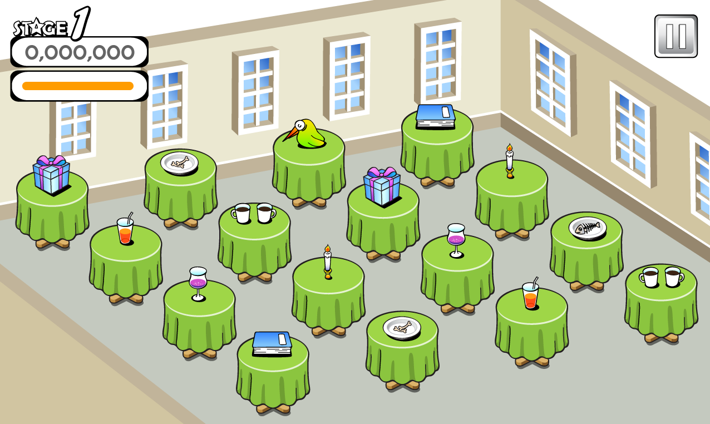
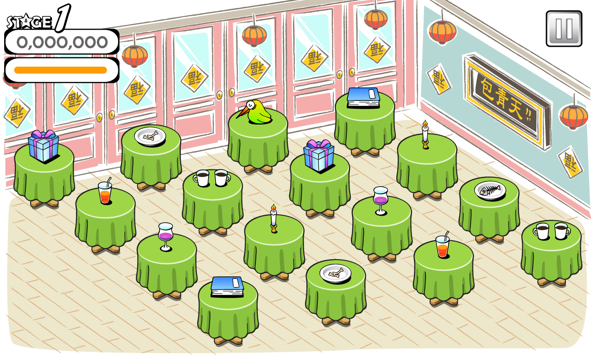

## About

This is a repository for creating and reviewing only game scenes to prove the concept of a game that clears the table.

## Development

- Install Cocos2dx(0x00020100)
- Open fffast.xcodeproj for xcode

## How to play

Swipe all tables to clear the stage. If you swipe too slowly, things on the table will fall and fail.

## Coding style

```sh
find . -name \* -print0 | xargs -0 -n1 clang-format -i
```

## Preview




## License

The Poc FFFast Game project is open-sourced software licensed under the [MIT license](https://opensource.org/licenses/MIT).
